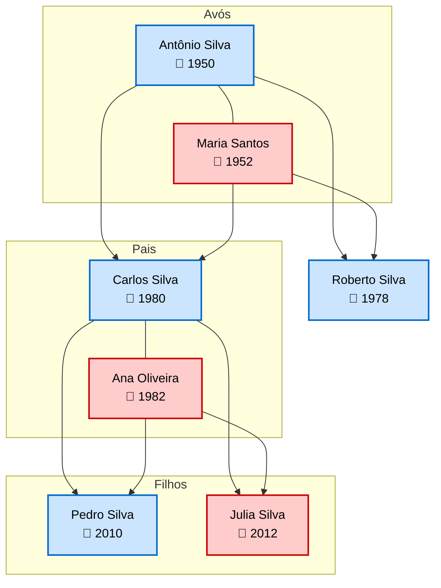

```mermaid
flowchart TB
    %% Estilização
    classDef masculino fill:#cce5ff,stroke:#0066cc,stroke-width:2px,color:#000
    classDef feminino fill:#ffcccc,stroke:#cc0000,stroke-width:2px,color:#000
    classDef casamento stroke-dasharray: 5 5,stroke:#666,stroke-width:2px
    
    %% Avós
    AvoM[Antônio Silva<br/>📅 1950]:::masculino
    AvoF[Maria Santos<br/>📅 1952]:::feminino
    
    %% Pais
    PaiM[Carlos Silva<br/>📅 1980]:::masculino
    MaeF[Ana Oliveira<br/>📅 1982]:::feminino
    
    %% Filhos
    FilhoM[Pedro Silva<br/>📅 2010]:::masculino
    FilhaF[Julia Silva<br/>📅 2012]:::feminino
    
    %% Tios
    TioM[Roberto Silva<br/>📅 1978]:::masculino
    
    %% Relacionamentos
    AvoM --- AvoF
    AvoM & AvoF --> PaiM
    AvoM & AvoF --> TioM
    
    PaiM --- MaeF
    PaiM & MaeF --> FilhoM
    PaiM & MaeF --> FilhaF
    
    %% Layout
    subgraph Avós
        AvoM
        AvoF
    end
    
    subgraph Pais
        PaiM
        MaeF
    end
    
    subgraph Filhos
        FilhoM
        FilhaF
    end
```