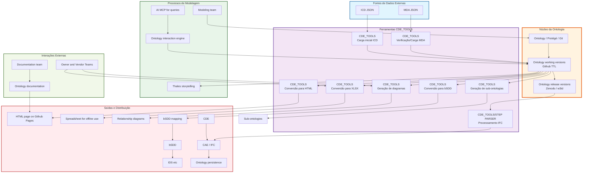

```mermaid
flowchart TD
    %% ========== GRUPO 1: PROCESSOS DE ENTRADA ==========
    subgraph Inputs [Fontes de Dados Externas]
        direction LR
        MDA[MDA JSON]
        ICD[ICD JSON]
    end

    %% ========== GRUPO 2: FERRAMENTAS DE PROCESSAMENTO ==========
    subgraph Tools [Ferramentas CDE_TOOLS]
        direction TB
        T1[CDE_TOOLS<br>Verificação/Carga MDA]
        T2[CDE_TOOLS<br>Carga inicial ICD]
        T3[CDE_TOOLS<br>Geração de sub-ontologias]
        T4[CDE_TOOLS<br>Conversão para HTML]
        T5[CDE_TOOLS<br>Conversão para XLSX]
        T6[CDE_TOOLS<br>Geração de diagramas]
        T7[CDE_TOOLS<br>Conversão para bSDD]
        T8[CDE_TOOLS/STEP PARSER<br>Processamento IFC]
    end

    %% ========== GRUPO 3: ONTOLOGIA CENTRAL ==========
    subgraph Core [Núcleo da Ontologia]
        direction TB
        OntologyWork[Ontology working versions<br>Github TTL]
        OntologyModel[Ontology / Protégé / Git]
        OntologyRelease[Ontology release versions<br>Zenodo / w3id]
    end

    %% ========== GRUPO 4: PROCESSOS DE MODELAGEM ==========
    subgraph Modeling [Processos de Modelagem]
        direction TB
        ModelTeam[Modeling team]
        AIEngine[AI MCP for queries]
        OntologyEngine[Ontology interaction engine]
        Storytelling[Thales storytelling]
    end

    %% ========== GRUPO 5: SAÍDAS E DISTRIBUIÇÃO ==========
    subgraph Outputs [Saídas e Distribuição]
        direction LR
        HTML[HTML page on Github Pages]
        Spreadsheet[Spreadsheet for offline use]
        Diagrams[Relationship diagrams]
        bSDDmap[bSDD mapping]
        bSDD[bSDD]
        IDS[IDS etc]
        CAE[CAE / IFC]
        CDE[CDE]
        Persistence[Ontology persistence]
    end

    %% ========== GRUPO 6: INTERAÇÕES EXTERNAS ==========
    subgraph External [Interações Externas]
        direction LR
        VendorTeam[Owner and Vendor Teams]
        DocTeam[Documentation team]
        Documentation[Ontology documentation]
    end

    %% ========== CONEXÕES PRINCIPAIS ==========
    %% Fluxo de dados de entrada
    MDA --> T1
    ICD --> T2
    T1 --> OntologyWork
    T2 --> OntologyWork
    
    %% Processamento central
    OntologyWork --> T3
    OntologyWork --> T4
    OntologyWork --> T5
    OntologyWork --> T6
    OntologyWork --> T7
    OntologyWork --> OntologyRelease
    OntologyRelease --> T8
    
    ModelTeam --> OntologyModel
    OntologyModel --> OntologyWork
    AIEngine --> OntologyEngine
    OntologyEngine --> OntologyWork
    OntologyWork --> Storytelling
    
    %% Geração de saídas
    T3 --> SubOntologies[Sub-ontologies]
    T4 --> HTML
    T5 --> Spreadsheet
    T6 --> Diagrams
    T7 --> bSDDmap
    bSDDmap --> bSDD
    bSDD --> IDS
    T8 --> CAE
    CDE --> CAE
    CAE --> Persistence
    
    %% Interações com usuários externos
    VendorTeam --> T5
    VendorTeam --> T6
    DocTeam --> Documentation
    Documentation --> HTML
    
    %% Estilos para melhor visualização
    style Inputs fill:#e1f5fe,stroke:#01579b,stroke-width:2px
    style Tools fill:#f3e5f5,stroke:#4a148c,stroke-width:2px
    style Core fill:#fff3e0,stroke:#e65100,stroke-width:3px
    style Modeling fill:#e8f5e9,stroke:#1b5e20,stroke-width:2px
    style Outputs fill:#ffebee,stroke:#b71c1c,stroke-width:2px
    style External fill:#f1f8e9,stroke:#33691e,stroke-width:2px
```