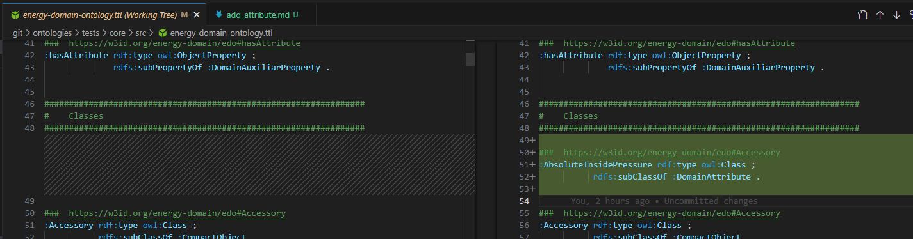

## Ontology entities templates:

There are two ways to create entities on the ontology:
###### 1. Predicate Lists (Compacted mode)
In compact mode, all assertions about the same subject are grouped:
```turtle
:ActuatedEquipment rdf:type owl:Class ;
                   rdfs:subClassOf :SubseaEquipment .
```

###### 2. Complete triples (Expanded mode)
In expanded mode, all assertions are created on an individual line:
```turtle
:ActuatedEquipment rdf:type owl:Class .
:ActuatedEquipment rdfs:subClassOf :SubseaEquipment .
```

## Templates
These are the minimal information about any entity, its type and its super class:
##### 1. Domain Objects (Assets, types etc.)
```turtle
:ActuatedEquipment rdf:type owl:Class .
:ActuatedEquipment rdfs:subClassOf :SubseaEquipment .
```

##### 2. Domain Attributes (Pressure, Temperature etc.)
```turtle
:AbsoluteInsidePressure rdf:type owl:Class ;
:AbsoluteInsidePressure rdfs:subClassOf edo:DomainAttribute .
```

### VSCode example
